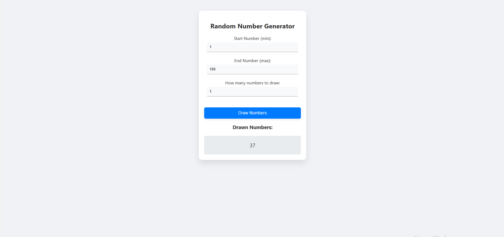

# Sorteador de números

## Sobre

Este projeto foi desenvolvido com o objetivo de aprimorar minhas habilidades em JavaScript e numeros aleatórios, além de fornecer um projeto simples serve como um excelente projeto prático para iniciantes.

## Layout

## Tecnologias Usadas

- JavaScript
- HTML
- CSS

## Como usar

1. Clone the repository:

https://github.com/LucasSobrinh0/identificador_de_cores

2. Rode localmente na sua máquina com a extensão Live Server do VSCode.

## Autor

Lucas Sobrinho Carneiro

Linkedin: https://www.linkedin.com/in/lucas-sobrinho-c-b9b6661b9/

Email: lucas.sobrinho.crn@gmail.com
